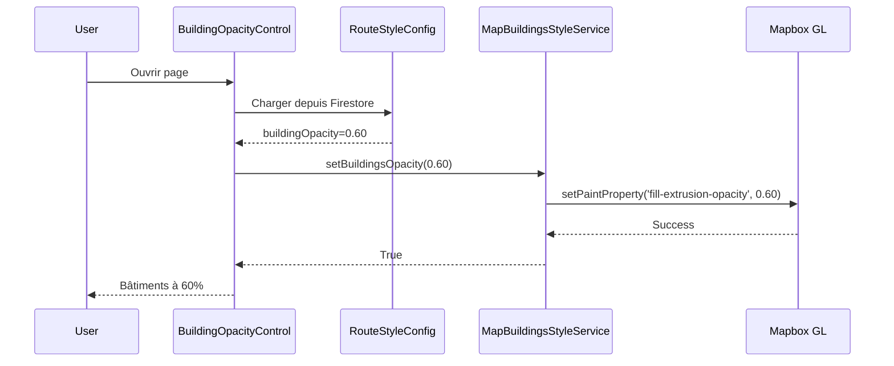
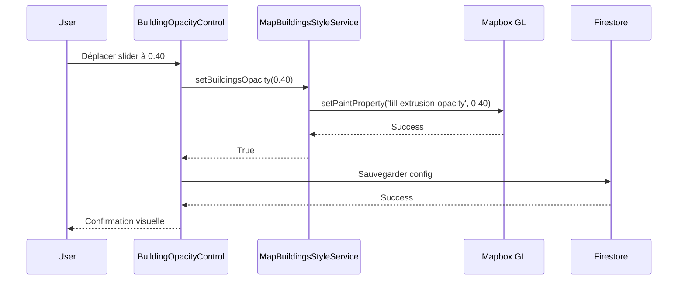
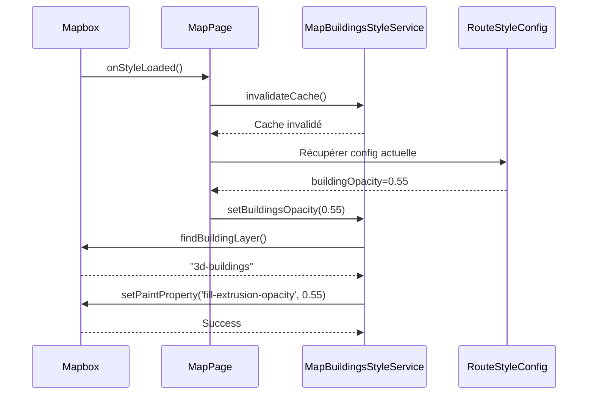

# 🏗️ Architecture Technique - Transparence Immeubles 3D

## 📐 Vue d'ensemble

Ce document détaille l'architecture technique du système de contrôle de transparence des immeubles 3D Mapbox.

---

## 🎯 Objectifs Techniques

1. **Contrôle temps réel** de l'opacité des bâtiments 3D (0-100%)
2. **Compatibilité web et natif** avec abstraction propre
3. **Persistance automatique** via Firestore
4. **Performance optimisée** (cache, appels minimaux)
5. **Fallback gracieux** si couche 3D absente

---

## 📂 Structure des Fichiers

```
app/lib/
├── route_style_pro/
│   ├── models/
│   │   └── route_style_config.dart          [MODIFIÉ] ← Ajout buildingOpacity, buildings3dEnabled
│   ├── services/
│   │   ├── map_buildings_style_service.dart      [NOUVEAU] ← Interface abstraite
│   │   ├── map_buildings_style_service_web.dart  [NOUVEAU] ← Implémentation web (JS bridge)
│   │   └── map_buildings_style_service_native.dart [NOUVEAU] ← Implémentation native (TODOs)
│   ├── ui/
│   │   └── widgets/
│   │       ├── building_opacity_control.dart          [NOUVEAU] ← Widget UI premium
│   │       └── route_style_controls_panel.dart        [MODIFIÉ] ← Intégration widget
│   └── INTEGRATION_EXAMPLE.dart             [NOUVEAU] ← Exemples code
└── web/
    └── mapbox_bridge.js                     [MODIFIÉ] ← 4 fonctions JS ajoutées

docs/
├── BUILDINGS_OPACITY_INTEGRATION_GUIDE.md   [NOUVEAU] ← Guide complet
└── BUILDINGS_OPACITY_TEST_CHECKLIST.md      [NOUVEAU] ← Checklist tests
```

---

## 🧩 Composants Détaillés

### 1. Modèle de Données : `RouteStyleConfig`

**Fichier :** `lib/route_style_pro/models/route_style_config.dart`

#### Nouveaux champs

```dart
class RouteStyleConfig {
  // Existants...
  
  // Nouveaux ↓
  final bool buildings3dEnabled;    // Activer/désactiver bâtiments
  final double buildingOpacity;     // Opacité 0.0-1.0
  
  RouteStyleConfig({
    // ...
    this.buildings3dEnabled = true,
    this.buildingOpacity = 0.60,
  });
}
```

#### Méthodes modifiées

| Méthode | Modification |
|---------|--------------|
| `copyWith()` | Ajout paramètres `buildings3dEnabled`, `buildingOpacity` |
| `validated()` | Clamp `buildingOpacity` entre 0.0 et 1.0 |
| `toJson()` | Sérialisation des 2 nouveaux champs |
| `fromJson()` | Désérialisation avec valeurs par défaut |

#### Exemple JSON Firestore

```json
{
  "routeStylePro": {
    "strokeColor": "#FF5722",
    "strokeWidth": 6.0,
    "buildings3dEnabled": true,
    "buildingOpacity": 0.55
  }
}
```

---

### 2. Service Abstrait : `MapBuildingsStyleService`

**Fichier :** `lib/route_style_pro/services/map_buildings_style_service.dart`

#### Interface

```dart
abstract class MapBuildingsStyleService {
  static const possibleLayerIds = [
    '3d-buildings',
    'building-3d',
    'buildings-3d',
    'maslive-3d-buildings',
    'building',
  ];
  
  Future<bool> setBuildingsOpacity(double opacity);
  Future<double?> getBuildingsOpacity();
  Future<bool> setBuildingsEnabled(bool enabled);
  Future<bool> is3DBuildingsAvailable();
  Future<String?> findBuildingLayer();
  void invalidateCache();
}
```

#### Rôle

- Définit le contrat commun web/natif
- Liste les IDs de couches possibles
- Fournit méthodes debug (`findBuildingLayer`, logs)

---

### 3. Implémentation Web : `MapBuildingsStyleServiceWeb`

**Fichier :** `lib/route_style_pro/services/map_buildings_style_service_web.dart`

#### Architecture

```
Dart (Flutter Web)
     ↓
JS Interop (dart:js_interop)
     ↓
window.mapboxBridge (namespace JS)
     ↓
Mapbox GL JS API
```

#### Cache

```dart
String? _cachedLayerId;
bool _cacheValid = false;

void invalidateCache() {
  _cachedLayerId = null;
  _cacheValid = false;
}
```

**Pourquoi ?** Éviter de chercher la couche à chaque appel (coûteux).

#### Appel JavaScript

```dart
Future<Object?> _callJsFunction(String functionName, [List<Object?>? args]) async {
  try {
    final result = (globalContext['mapboxBridge'] as JSObject)
        .callMethod(functionName.toJS, args?.map((a) => a?.jsify()).toList());
    return result?.dartify();
  } catch (e) {
    _log('JS call error: $functionName - $e');
    return null;
  }
}
```

#### Méthodes implémentées

| Méthode | Appel JS | Description |
|---------|----------|-------------|
| `findBuildingLayer()` | `findBuildingLayer()` | Cherche ID couche 3D |
| `setBuildingsOpacity(opacity)` | `setBuildingsOpacity(layerId, opacity)` | Change opacité |
| `getBuildingsOpacity()` | `getBuildingsOpacity(layerId)` | Récupère opacité |
| `setBuildingsEnabled(enabled)` | `setBuildingsEnabled(layerId, enabled)` | Visible/Hidden |

---

### 4. Implémentation Native : `MapBuildingsStyleServiceNative`

**Fichier :** `lib/route_style_pro/services/map_buildings_style_service_native.dart`

#### État actuel

⚠️ **Structure complète, implémentation TODO**

```dart
class MapBuildingsStyleServiceNative extends MapBuildingsStyleService {
  MapboxMap? _mapboxMap; // Instance du SDK
  
  void setMapInstance(MapboxMap map) {
    _mapboxMap = map;
    invalidateCache();
  }
  
  @override
  Future<bool> setBuildingsOpacity(double opacity) async {
    // TODO: Implémenter avec SDK Mapbox natif
    // Exemple:
    // await _mapboxMap.style.setStyleLayerProperty(
    //   layerId,
    //   'fill-extrusion-opacity',
    //   opacity,
    // );
    return false;
  }
  
  // ... autres méthodes avec TODOs
}
```

#### Intégration nécessaire

1. Importer le SDK Mapbox Maps Flutter
2. Injecter l'instance `MapboxMap` via `setMapInstance()`
3. Utiliser l'API du SDK pour modifier les propriétés des couches
4. Tester sur iOS et Android

---

### 5. Widget UI : `BuildingOpacityControl`

**Fichier :** `lib/route_style_pro/ui/widgets/building_opacity_control.dart`

#### Composants visuels

```
┌─────────────────────────────────────────┐
│ 🏢 Transparence immeubles  60%   (?)   │
├─────────────────────────────────────────┤
│ [●] Activer immeubles 3D                │
├─────────────────────────────────────────┤
│ Opacité: 60%                            │
│ ├────────────●─────────────┤           │
│   0%                      100%          │
├─────────────────────────────────────────┤
│ [Opaque] [Confort] [Équilibré] ...      │
├─────────────────────────────────────────┤
│            [🔄 Réinitialiser]           │
└─────────────────────────────────────────┘
```

#### Presets

```dart
static const List<({String label, double value})> presets = [
  (label: 'Opaque', value: 1.0),
  (label: 'Confort', value: 0.70),
  (label: 'Équilibré', value: 0.55),
  (label: 'Léger', value: 0.35),
  (label: 'Ghost', value: 0.20),
];
```

#### Props

```dart
final RouteStyleConfig config;         // Config actuelle
final ValueChanged<RouteStyleConfig> onChanged;  // Callback changements
```

#### Logique

- **Switch** → Modifie `buildings3dEnabled`
- **Slider** → Modifie `buildingOpacity` (0.0-1.0)
- **Preset chip** → Set `buildingOpacity` à valeur preset
- **Réinitialiser** → Reset à 0.60

---

### 6. JavaScript Bridge : `mapbox_bridge.js`

**Fichier :** `web/mapbox_bridge.js`

#### Namespace

```javascript
window.mapboxBridge = {
  findBuildingLayer: function(map) { /* ... */ },
  setBuildingsOpacity: function(layerId, opacity, map) { /* ... */ },
  getBuildingsOpacity: function(layerId, map) { /* ... */ },
  setBuildingsEnabled: function(layerId, enabled, map) { /* ... */ },
};
```

#### Fonction 1 : `findBuildingLayer(map)`

```javascript
findBuildingLayer: function(map) {
  const possibleIds = [
    '3d-buildings',
    'building-3d',
    'buildings-3d',
    'maslive-3d-buildings',
    'building'
  ];
  
  // 1. Chercher dans possibleIds
  for (const id of possibleIds) {
    const layer = map.getLayer(id);
    if (layer && layer.type === 'fill-extrusion') {
      console.log('[BuildingsOpacity] layer found:', id);
      return id;
    }
  }
  
  // 2. Fallback : chercher ANY fill-extrusion
  const layers = map.getStyle().layers || [];
  for (const layer of layers) {
    if (layer.type === 'fill-extrusion') {
      console.log('[BuildingsOpacity] fallback layer found:', layer.id);
      return layer.id;
    }
  }
  
  console.warn('[BuildingsOpacity] no fill-extrusion layer found');
  return null;
}
```

**Stratégie :** Liste priorisée → Fallback any → null

#### Fonction 2 : `setBuildingsOpacity(layerId, opacity, map)`

```javascript
setBuildingsOpacity: function(layerId, opacity, map) {
  try {
    const clampedOpacity = Math.max(0, Math.min(1, opacity));
    map.setPaintProperty(layerId, 'fill-extrusion-opacity', clampedOpacity);
    console.log(`[BuildingsOpacity] apply opacity=${clampedOpacity} layer=${layerId} success`);
    return true;
  } catch (e) {
    console.error('[BuildingsOpacity] setBuildingsOpacity error:', e);
    return false;
  }
}
```

**Propriété Mapbox :** `fill-extrusion-opacity` (0.0 → transparent, 1.0 → opaque)

#### Fonction 3 : `getBuildingsOpacity(layerId, map)`

```javascript
getBuildingsOpacity: function(layerId, map) {
  try {
    const opacity = map.getPaintProperty(layerId, 'fill-extrusion-opacity');
    return opacity !== undefined ? opacity : 0.7; // Défaut
  } catch (e) {
    console.error('[BuildingsOpacity] getBuildingsOpacity error:', e);
    return null;
  }
}
```

#### Fonction 4 : `setBuildingsEnabled(layerId, enabled, map)`

```javascript
setBuildingsEnabled: function(layerId, enabled, map) {
  try {
    const visibility = enabled ? 'visible' : 'none';
    map.setLayoutProperty(layerId, 'visibility', visibility);
    console.log(`[BuildingsOpacity] setBuildingsEnabled visible=${enabled} layer=${layerId} success`);
    return true;
  } catch (e) {
    console.error('[BuildingsOpacity] setBuildingsEnabled error:', e);
    return false;
  }
}
```

**Propriété Mapbox :** `visibility` ('visible' | 'none')

---

## 🔄 Flux de Données

### Chargement Initial



### Changement Utilisateur



### Changement de Style Mapbox



---

## 🎨 Propriétés Mapbox Utilisées

### `fill-extrusion-opacity`

**Type :** Paint property  
**Valeur :** Number (0.0 - 1.0)  
**Défaut :** 1.0  
**Description :** Opacité globale des extrusions 3D  

**Exemple :**
```javascript
map.setPaintProperty('3d-buildings', 'fill-extrusion-opacity', 0.55);
```

### `visibility`

**Type :** Layout property  
**Valeur :** 'visible' | 'none'  
**Défaut :** 'visible'  
**Description :** Afficher ou masquer la couche  

**Exemple :**
```javascript
map.setLayoutProperty('3d-buildings', 'visibility', 'none');
```

---

## ⚡ Optimisations Performances

### 1. Cache de l'ID de couche

```dart
String? _cachedLayerId;
bool _cacheValid = false;

Future<String?> findBuildingLayer() async {
  if (_cacheValid && _cachedLayerId != null) {
    return _cachedLayerId;
  }
  // ... recherche
  _cachedLayerId = result;
  _cacheValid = true;
  return result;
}
```

**Gain :** Évite de parcourir toutes les couches à chaque appel.

### 2. Clamp côté JS

```javascript
const clampedOpacity = Math.max(0, Math.min(1, opacity));
```

**Gain :** Évite erreurs valeurs hors limites.

### 3. Validation côté modèle

```dart
RouteStyleConfig validated() {
  return copyWith(
    buildingOpacity: buildingOpacity.clamp(0.0, 1.0),
  );
}
```

**Gain :** Garantit données valides avant persistance.

### 4. Pas de re-render inutile

Le widget utilise `ValueChanged` callback plutôt que setState global.

---

## 🔒 Sécurité et Robustesse

### Try-Catch partout

```dart
try {
  await _buildingsService.setBuildingsOpacity(opacity);
} catch (e) {
  debugPrint('[BuildingsOpacity] Error: $e');
  // UI continue de fonctionner
}
```

### Fallback gracieux

```javascript
if (!layer) {
  console.warn('[BuildingsOpacity] no fill-extrusion layer found');
  return null; // Pas de crash
}
```

### Validation des entrées

```dart
final clampedOpacity = opacity.clamp(0.0, 1.0);
```

### Logs debug

Tous les appels loggent leur résultat : `[BuildingsOpacity] ...`

---

## 📊 Métriques Techniques

| Métrique | Valeur |
|----------|--------|
| **Fichiers créés** | 6 |
| **Fichiers modifiés** | 2 |
| **Lignes de code Dart ajoutées** | ~800 |
| **Lignes de code JavaScript ajoutées** | ~140 |
| **Classes abstraites** | 1 |
| **Implémentations services** | 2 (web complet, natif structure) |
| **Widgets UI** | 1 |
| **Fonctions JavaScript** | 4 |
| **Nouveaux champs RouteStyleConfig** | 2 |
| **Tests manuels** | 13 scenarios |

---

## 🔮 Évolutions Futures

### Court terme (1-2 semaines)

- [ ] Compléter implémentation native (iOS/Android)
- [ ] Tester sur devices physiques
- [ ] Optimiser performance mobile
- [ ] Ajouter tests automatisés (unit + integration)

### Moyen terme (1-2 mois)

- [ ] Mode "Auto" : ajuster opacité selon zoom
- [ ] Synchronisation temps réel multi-utilisateurs
- [ ] Preview miniature dans le widget
- [ ] Animations de transition (fade in/out)

### Long terme (3-6 mois)

- [ ] Contrôle par bâtiment individuel (sélection)
- [ ] Couleur des bâtiments personnalisable
- [ ] Hauteur des bâtiments ajustable
- [ ] Export/import presets utilisateur

---

## 🛠️ Dépendances

### Dart/Flutter

```yaml
dependencies:
  flutter:
    sdk: flutter
  cloud_firestore: ^4.0.0  # Persistance
  # Pas de nouvelle dépendance nécessaire
```

### JavaScript

```javascript
// Mapbox GL JS (déjà inclus)
<script src='https://api.mapbox.com/mapbox-gl-js/v2.x.x/mapbox-gl.js'></script>
```

### SDK Natif (TODO)

```yaml
dependencies:
  mapbox_maps_flutter: ^2.0.0  # Ou version utilisée
```

---

## 📚 Références Techniques

### Documentation Mapbox

- [Fill Extrusion Layer](https://docs.mapbox.com/mapbox-gl-js/style-spec/layers/#fill-extrusion)
- [setPaintProperty](https://docs.mapbox.com/mapbox-gl-js/api/map/#map#setpaintproperty)
- [setLayoutProperty](https://docs.mapbox.com/mapbox-gl-js/api/map/#map#setlayoutproperty)

### Flutter Interop

- [dart:js_interop](https://dart.dev/web/js-interop)
- [Calling JavaScript from Dart](https://dart.dev/web/js-interop/usage)

### Architecture Pattern

- **Service Locator** : Injection via constructor
- **Strategy Pattern** : Abstraction web/natif
- **Observer Pattern** : ValueChanged callbacks

---

## 🧪 Tests Automatisés (TODO)

### Unit Tests

```dart
testWidgets('BuildingOpacityControl displays correct percentage', (tester) async {
  final config = RouteStyleConfig(buildingOpacity: 0.60);
  
  await tester.pumpWidget(
    MaterialApp(
      home: BuildingOpacityControl(
        config: config,
        onChanged: (_) {},
      ),
    ),
  );
  
  expect(find.text('60%'), findsOneWidget);
});
```

### Integration Tests

```dart
testWidgets('Changing slider updates opacity in real-time', (tester) async {
  // Mock MapBuildingsStyleService
  // Interact with slider
  // Verify service method called with correct value
});
```

---

## 🎓 Patterns Architecturaux

### 1. Abstraction Layer (Service)

```
Abstract Service
    ↓
┌───────────┴───────────┐
Web Service         Native Service
```

**Avantage :** Code métier unifié, implémentations séparées.

### 2. Value Objects (RouteStyleConfig)

```dart
final config = RouteStyleConfig(buildingOpacity: 0.60);
final newConfig = config.copyWith(buildingOpacity: 0.40);
```

**Avantage :** Immutabilité, sérialisation simple.

### 3. Callback Pattern (ValueChanged)

```dart
onChanged: (RouteStyleConfig newConfig) {
  // Parent handle update
}
```

**Avantage :** Inversion de contrôle, testabilité.

### 4. Bridge Pattern (JS Interop)

```
Dart ↔ JS Interop ↔ JavaScript ↔ Mapbox GL
```

**Avantage :** Séparation plateforme web du code métier.

---

## 🎨 Conventions de Code

### Nommage

- **Services** : `MapXxxStyleService`
- **Widgets** : `XxxControl`
- **Fichiers** : snake_case
- **Classes** : PascalCase
- **Méthodes/Variables** : camelCase

### Logs

```dart
debugPrint('[BuildingsOpacity] message');  // Dart
console.log('[BuildingsOpacity] message'); // JavaScript
```

**Pourquoi ?** Filtrage facile dans les logs.

### TODOs

```dart
// TODO: Implémenter avec SDK Mapbox natif
```

**Format standard** pour tracking.

---

## 🌟 Points Clés du Design

1. **Séparation des préoccupations** : UI ↔ Service ↔ API Mapbox
2. **Réutilisabilité** : Service utilisable dans n'importe quelle page
3. **Testabilité** : Services mockables, widgets isolés
4. **Performance** : Cache, appels minimaux
5. **Robustesse** : Try-catch, fallbacks, validation
6. **Extensibilité** : Facile d'ajouter nouvelles propriétés

---

**Auteur:** GitHub Copilot (Claude Sonnet 4.5)  
**Date:** Mars 2026  
**Version:** 1.0.0
